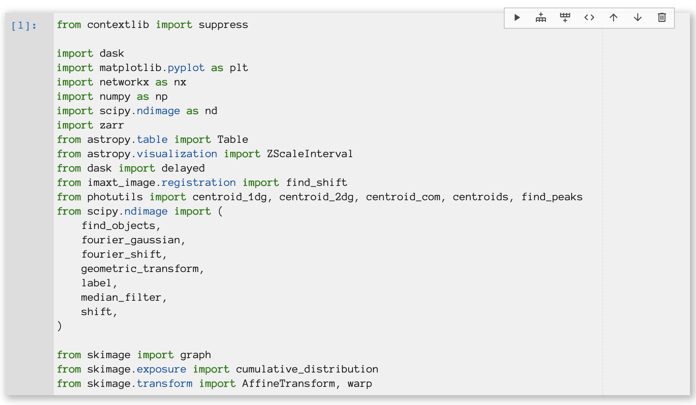

# @eddienko/jupyterlab-colabinspired-theme-light

[](https://mybinder.org/v2/gh/eddienko/jupyterlab-colabinspired-codecellbtn/binder?urlpath=/lab/tree/demo/demo.ipynb)

A JupyterLab theme extension inspired in Colab. The theme adds a drop shadow to the active cell.




## Prerequisites

* JupyterLab

## Installation

```bash
jupyter labextension install @eddienko/jupyterlab-colabinspired-theme-light
```

In order to display the cell buttons on each cell you need to install as well
[@eddienko/jupyterlab-colabinspired-codecellbtn](https://github.com/eddienko/jupyterlab-colabinspired-codecellbtn)

## Development

For a development install (requires npm version 4 or later), do the following in the repository directory:

```bash
npm install
jupyter labextension link .
```

To rebuild the package and the JupyterLab app:

```bash
npm run build
jupyter lab build
```
